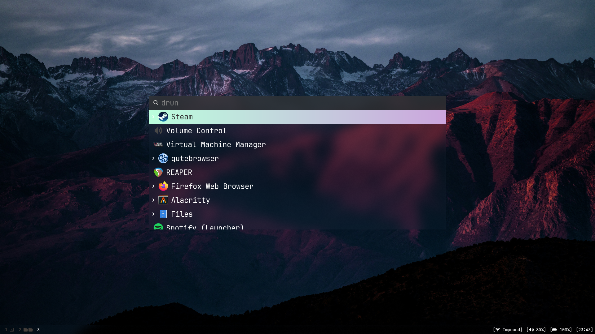
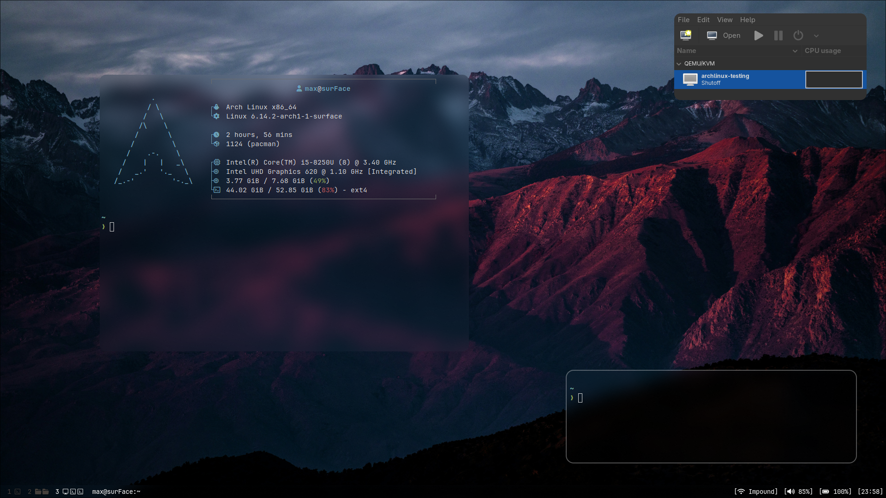

# My Arch/Debian package configurations
My custom configuration for hyprland, dwm, neovim, and various other programs I use regularly.

## Table of Contents
- [Introduction](#introduction)
- [Installation](#installation)
- [Configs](#configs)
    - [hyprland](#hyprland)
    - [dwm](#dwm)
    - [nvim](#neovim)
    - [Reaper](#reaper)

## Introduction
I currently have the install scipt working for Arch linux. I plan to mainly use this for documentation in my Linux journey. And I do plan to have a Debian configuration eventually.

## Installation
1. Clone the repo in your **home directory**, like so
```bash
git clone https://github.com/9Prestidigitator/dotfiles.git
```
2. Change directory to the repository
```bash
cd dotfiles
```
3. run installation script (Most configs are arch only for now):
```bash
./install
```
Warning: This script is quite destructive with the configuration of most of these packages. If you have existing configurations for these programs you may loose them.

## Configs
### hyprland
```MODKEY``` is set to the windows key.

### dwm
```MODKEY``` is set to the windows key.

#### Keybindings
```bash MODKEY``` is set to the windows key by default.
- Program Launching
    - MODKEY + SPACE: start dmenu (search for programs)
    - MODKEY + ENTER: Open new terminal
    - MODKEY + e: New file explorer (default: nautilus)
    - MODKEY + SHIFT + b: New browser (default: firefox)
- Window Manipulation
    - MODKEY + q: Kill program
    - MODKEY + j: Focus window up
    - MODKEY + k: Focus window down
    - MODKEY + i: Split window horizontal
    - MODKEY + d: Split window vertical
    - MODKEY + SHIFT + h: Decrease window size
    - MODKEY + SHIFT + l: Increase window size
    - MODKEY + SHIFT + ENTER: Move window to top
    - MODKEY + t: Switch to tiling mode
    - MODKEY + f: Switch to floating mode
    - MODKEY + m: Switch to monocle mode
    - MODKEY + p: Switch to previously used mode
    - MODKEY + SHIFT + SPACE: Toggle window to be floating 
- Tags
    - MODKEY + TAB: Switch to previously focused tag
    - MODKEY + z: Switch to lower tag
    - MODKEY + x: Switch to upper tag
    - MODKEY + [1-9]: Move to tag 1 through 9
- System
    - MODKEY + .: Focus next monitor 
    - MODKEY + .: Focus next monitor 
    - MODKEY + SHIFT + .: Move window to next monitor 
    - MODKEY + SHIFT + ,: Move window to previous monitor 
    - MODKEY + b: Toggle bar

### Neovim
Uses my neovim configuration github repository.

### Reaper
